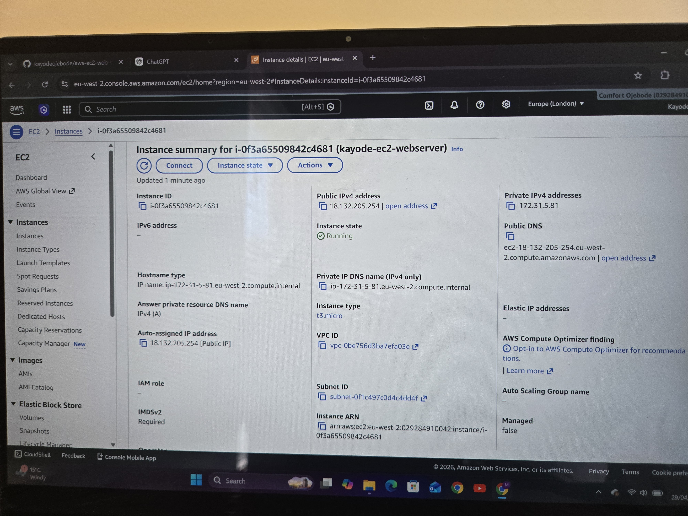
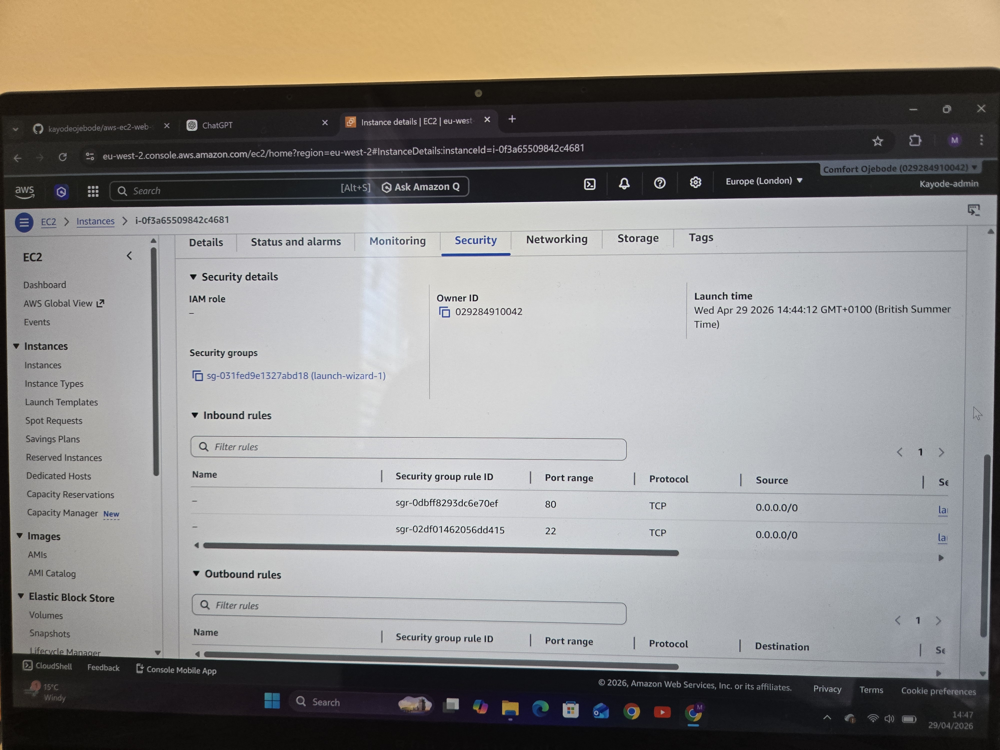
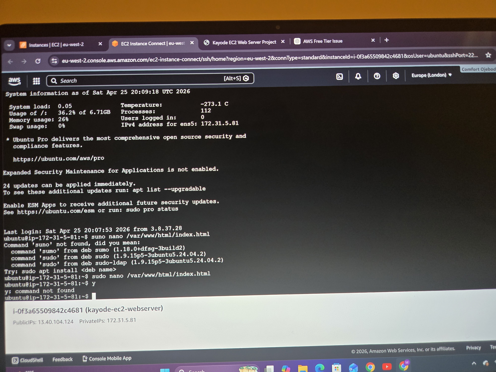
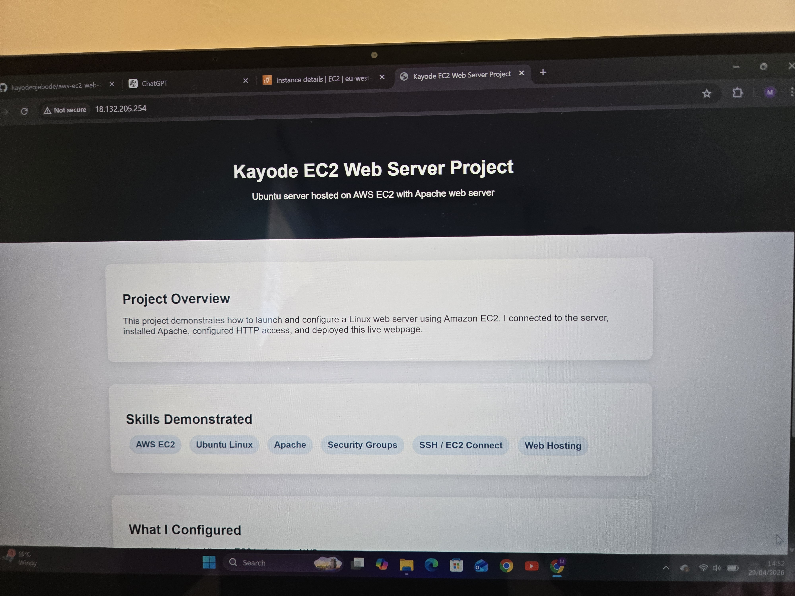
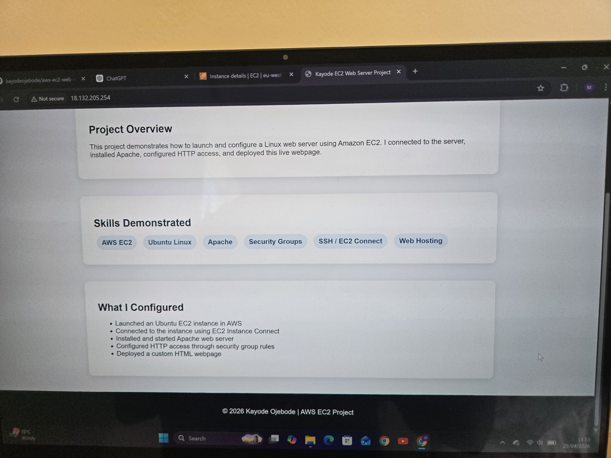

# 🚀 AWS EC2 Web Server Project

## 📌 Overview
This project demonstrates how to deploy a web server on AWS EC2 using Ubuntu and Apache.

---

## ⚙️ Technologies Used

## 🛠️ Technologies Used
- AWS EC2
- Ubuntu Linux
- Apache Web Server
- Security Groups

## ⚙️ Setup Steps

1. Launch EC2 instance (Ubuntu)
2. Configure Security Group (HTTP & SSH)
3. Connect via SSH
4. Install Apache
5. Deploy HTML website

---

## 🧠 What I Learned

- How to launch and manage EC2 instances
- How to configure security groups for web traffic
- How to install and manage Apache on Linux
- How to deploy a live website using a public IP

---

## 🔧 What I Did

* Launched Ubuntu EC2 instance
* Connected using EC2 Instance Connect
* Installed Apache web server
* Started and enabled Apache service
* Configured inbound rules (HTTP - Port 80)
* Deployed a custom HTML website
* Accessed website via public IPv4

---

## 🧠 Skills Demonstrated

* Cloud computing (AWS EC2)
* Linux command line
* Web server setup (Apache)
* Networking & security groups
* Basic website deployment

---

## 🔧 Future Improvements

- Add HTTPS using AWS Certificate Manager
- Use Nginx instead of Apache
- Automate deployment using shell scripts
- Add CI/CD with GitHub Actions

---

## 📸 Screenshots

### EC2 Instance Running

### Security Group Configuration

### Apache Installation

### Live Website

### Live Website

---

## 💼 CV Description

Deployed and configured an Ubuntu web server on AWS EC2, installed Apache, enabled HTTP access via security groups, and hosted a live webpage using a public IPv4 address.

---

## 🔗 Live Demo

http://13.41.120.135
